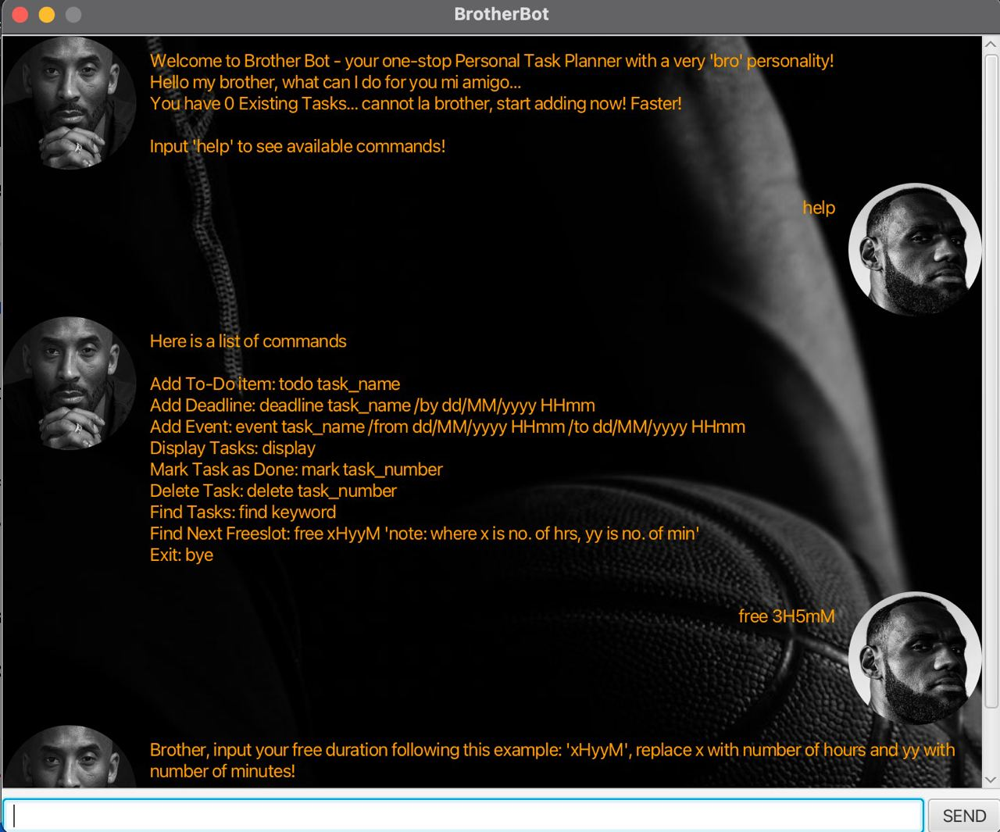

<div align= "center">
  <h1 align= "center">BrotherBot</h1>


> "We must live together as brothers or perish together like fools." - Martin Luther King Jr.
> 


</div>

## About The Project

### Overview
We all need a brother out there who's got our back all the time. Introducing BrotherBot, your one-stop task planner with a "Brother" personality.
BrotherBot is designed to help you manage tasks with a unique 'bro' personality, ensuring that you stay on top of your responsibilities while feeling supported. This application transitions from traditional task management methods to a friendly, interactive approach.

### Contributor(s)

- [Daniel Ling](https://github.com/danilingzy)

### Built With

This section lists major libraries used.

* [JavaFX](https://openjfx.io/)
* [JUnit](https://junit.org/junit5/)


## Features

<div align= "left">
    
- [X] Tracks tasks
- [ ] Eat supper with you *(coming soon)*

 </div>

 ***
### Adding Tasks
1. #### Add ToDo Tasks: ```todo```
   Add a ToDo task that you need to complete using the ```todo``` keyword.
   Example: ```todo run``` will add "run" to your list of tasks.

2. #### Add Deadline Tasks: ```deadline```
   Add a Deadline Task that you have to complete by a certain deadline using the ```deadline``` keyword.  
   Deadline will be entered behind a slash, with the format of ***'dd/MM/yyyy HHmm'***.
   Example: ```deadline project /by 23/02/2023 1400``` will add "project" to your list of tasks.

3. #### Add Event Tasks: ```event```
   Add an Event that you have to attend using the ```event``` keyword.  
   Duration of the event will be entered with behind a slash, with the first slash representing the start of the event and the second slash representing the end of the event.  
   Example: ```event CS2103T Lecture /from 17/01/2023 1400 /to 17/01/2023 1600``` will add "CS2103T Lecture" to your list of tasks.

***

### Deleting Tasks: ```delete```

Delete a task in the task list using the ```delete``` keyword.  
A positive integer (i.e., 1, 2, 3...) must be specified behind the keyword, and the task to be deleted should exist.
Example: ```delete 2``` will delete the second item in the list.

***

### Exiting the Application: ```bye```

Simply by using the keyword ```bye```, the program will exit on its own.
Example: ```bye``` will exit the program.

***

### Finding Tasks: ```find```

Find a task in the list using the ```find``` keyword.  
The task you are looking for should be entered behind the keyword.
Example: ```find project``` will list out all the tasks that contain the word 'project'.

***

### Displaying Tasks: ```display```

List out all the tasks using the ```display``` keyword.
Example: ```display``` will list out all the tasks that exist.

***

### Marking Tasks: ```mark```

Mark a task that has been completed using the ```mark``` keyword.   
A positive integer (i.e., 1, 2, 3...) should be specified behind the keyword.
Example: ```mark 3``` will mark the third task on the list.

***

### Finding Freeslot: ```free```

Find the next free slot using the ```free``` keyword.  
A valid duration of format ***'xHyyM'*** where x is the number of hours, and yy is the number of minutes, should be entered behind the keyword.
Example: ```free 2H30M``` will return your next free 2 hour 30 minute time slot.

## Getting Started

Bro! It is:

- ~~Hard~~ Easy to use
- *Friendly*
- Treats u like a real **bro** :star_struck:
  
### Wanna gain a real bro?

Download it [here](https://github.com/daniellingzy/ip/releases/tag/v0.2)

Here’s the `Launcher` class:
```java
package brotherbot;

import javafx.application.Application;

public class Launcher {
    public static void main(String[] args) {
        Application.launch(BrotherBot.class, args);
    }
}
```

